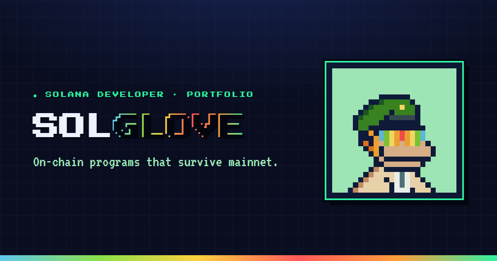

<div align="center">



# 🎮 SOLGLOVE

**Pixel-art arcade portfolio for a Solana developer.**

[](https://solglove.vercel.app)
&nbsp;


</div>

---

## ▰ What is this

A retro **arcade / RPG** themed portfolio for a Solana blockchain developer. The
whole visual language is derived from the pixel avatar: mint + navy + forest green,
with the rainbow visor stripe reused as the signature accent spectrum. No purple
gradients, no template, no AI slop — deliberate pixel craft with heavy motion.

## ▰ Features

- **Hero sprite** — avatar in an arcade frame, idle bob + CRT glitch slice, parallax pixel grid, spectrum wordmark, XP HUD
- **Character sheet** (About) — bio + animated ability-score bars
- **Inventory grid** (Skills) — tech stack as rarity-tiered loot in a cabinet
- **Quest log** (Projects) — expandable shipped / in-flight work
- **CLI terminal** (Contact) — typing animation + channel links
- Custom pixel crosshair cursor, CRT scanlines / grain / power-on sweep
- Marquee ticker · **Konami code** easter egg (`↑ ↑ ↓ ↓ ← → ← → B A`)
- WCAG-aware contrast + visible focus states, `prefers-reduced-motion` respected
- SEO-hardened: Open Graph + generated `og.png`, Twitter cards, JSON-LD
  (`WebSite` + `Person` + `ProfilePage`), `sitemap.xml`, `robots.txt`, web manifest

## ▰ Stack

`Vite 6` · `React 18` · `TypeScript 5` · `Tailwind CSS v4` · `Framer Motion (motion 11)`
· `Playwright` (screenshot + OG generation) · deployed on **Vercel**.

## ▰ Run locally

```bash
npm install
npm run dev        # http://localhost:5173
npm run build      # typecheck + production build to /dist
npm run preview    # serve the build
npm run shot       # Playwright screenshots → /shots (dev server must be running)
node scripts/og.mjs   # regenerate public/og.png
```

## ▰ Structure

```
src/
  data/portfolio.ts      ← all editable copy (profile, skills, projects)
  index.css              ← Tailwind v4 theme tokens + pixel design system
  components/
    Hero · About · Skills · Projects · Contact · Nav · Marquee · Footer
    Overlays (cursor, CRT boot, Konami) · Logo · ui/ (PixelButton, Reveal, …)
```

## ▰ Customize

Edit [`src/data/portfolio.ts`](src/data/portfolio.ts) — name, tagline, stats,
inventory, and quests all live there. Swap the placeholder GitHub / X / email /
Discord links and the experience entries with real ones.

---

<div align="center">
<sub>INSERT COIN · built with pixel energy · no templates</sub>
</div>
